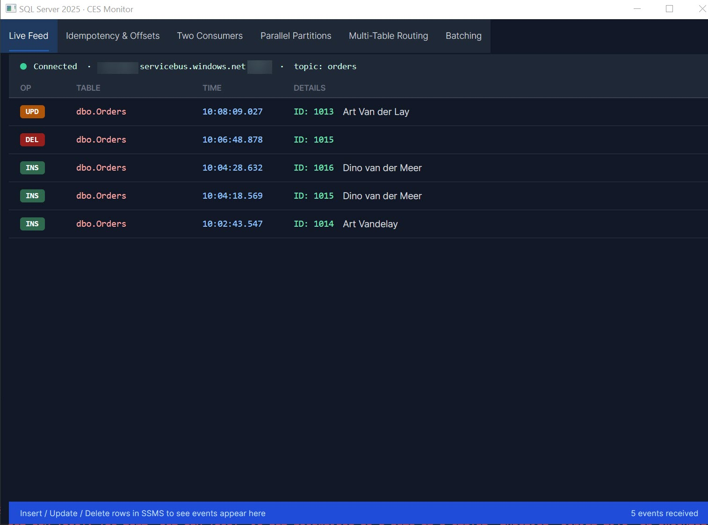
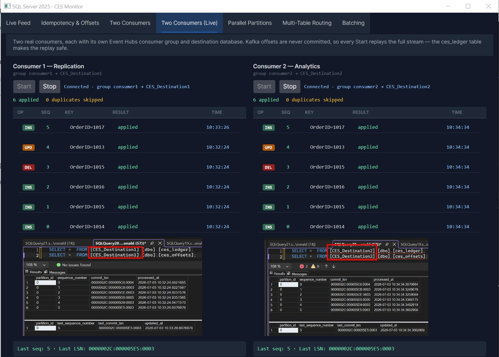

# SQL Server 2025 CES Monitor

A dark-mode Avalonia desktop app that shows SQL Server 2025 Change Event Streaming (CES) events in real time — every INSERT, UPDATE, and DELETE on the `Orders` table appears instantly in the UI, pushed through Azure Event Hubs.

Alongside the live feed, the app ships 5 self-contained scenario-simulation tabs that demonstrate core CES consumer design patterns (idempotency, multiple consumers, parallel partitions, multi-table routing, batching) entirely in-memory — no Event Hub or SQL Server connection required to explore them.



---

## What is CES?

Change Event Streaming (CES) is a log-based, push-driven change streaming engine built directly into the SQL Server storage engine.

It is not CDC, not Change Tracking, and not Query Store telemetry.

CES is a continuous event pipeline that streams committed changes from the transaction log into event streams that can be consumed by:

- Kafka
- Event Hubs
- Fabric Real-Time Hub
- Custom gRPC/WebSocket consumers
- SQL Server itself (internal pipelines)

CES is designed for sub-second latency, exactly-once delivery, and schema-aware change envelopes.

### CES Architecture

#### Log Capture Layer (LCL)

CES hooks directly into the log manager using a new internal component: **XEventLogCapture (XLC)**.

This layer reads logical log records after commit (Insert, Delete, Update, Schema changes, Metadata changes). It does not parse physical log blocks — it uses the same logical decoding layer used by AlwaysOn.

Key properties:

- Zero table locks
- No scan of base tables
- No CDC jobs, no SQL Agent, no polling, no triggers

CES is pure log-based streaming.

#### Change Normalization Layer (CNL)

Converts raw log records into CES envelopes. Each envelope contains:

- Operation: Insert / Update / Delete
- Primary key
- Before image (for updates/deletes) and after image (for inserts/updates)
- Commit LSN, Transaction ID, Ordering metadata
- Schema version and column-level change mask

CES envelopes are **schema-aware**, including column names, data types, nullability, collation, computed column definitions, and identity metadata. This makes CES strongly typed, unlike CDC's weakly typed `NVARCHAR` output.

#### Event Stream Engine (ESE)

The heart of CES — a multi-partition, ordered, durable event pipeline inside SQL Server.

- Each CES stream is a partitioned commit-ordered queue
- Backed by memory + persisted log segments
- Uses LSNs for ordering
- Supports exactly-once semantics, consumer offsets, replay and rewind, and multi-consumer fan-out

ESE is similar to Kafka's internal log segments, but implemented inside SQL Server.

#### Delivery Layer (DL)

Pushes CES envelopes to external systems.

**Push connectors:** Kafka, Event Hubs, Fabric Real-Time Hub, custom HTTP/gRPC/WebSocket endpoints

**Pull mode:** Consumers can request batches by offset.

**Delivery guarantees:** Exactly-once (with consumer offset tracking), at-least-once (for simple consumers), idempotent replay.

### How SQL Server Streams Changes

1. Transaction commits — log records written to the transaction log
2. XLC reads committed log records — no locks, no table scans
3. CNL converts log records into envelopes — strongly typed, schema-aware
4. ESE appends envelopes to stream partitions — ordered by commit LSN
5. DL pushes envelopes to consumers — Kafka/Event Hubs/Fabric/etc.
6. Consumers track offsets — SQL Server stores offsets for exactly-once delivery

### CES vs CDC vs Change Tracking

| Feature | CES | CDC | Change Tracking |
| --- | --- | --- | --- |
| Latency | Sub-second | Seconds/minutes | Minutes |
| Mechanism | Log-based streaming | Log-based batch decode | Versioning |
| Delivery | Push + Pull | Pull only | Pull only |
| Ordering | Commit-ordered | Not guaranteed | Not guaranteed |
| Schema | Strongly typed | Weak NVARCHAR | Weak |
| Before/After images | Yes | Yes | No |
| Exactly-once | Yes | No | No |
| Replay | Yes | No | No |
| Partitioning | Yes | No | No |
| Multi-consumer | Yes | No | No |
| Designed for | Real-time pipelines | ETL | Sync |

CES is essentially SQL Server's built-in Kafka-like change log.

### Performance Characteristics

**Zero impact on OLTP** — CES uses asynchronous log reading, memory buffers, no table access, no locks, no triggers.

**High throughput** — benchmarks show >100,000 events/sec per stream, <50 ms latency, horizontal scaling via partitions.

**Minimal log overhead** — CES piggybacks on existing log records.

---

## Architecture

```text
SQL Server 2025
  └─ CES (dbo.Orders)
       │  AMQP
       ▼
Azure Event Hubs (ces-poc / orders)
       │  Kafka protocol (port 9093, SASL/SSL)
       │
       ├─ consumer group $Default   → Live Feed tab (display only)
       ├─ consumer group consumer1  → CES_Destination1 (Two Consumers Live)
       └─ consumer group consumer2  → CES_Destination2 (Two Consumers Live)
```

One stream, three independent readers — Event Hubs fan-out. The Live Feed only displays events; the two live consumers apply them to their own destination database using a ledger + offset store for exactly-once semantics.

---

## Prerequisites

| Requirement | Notes |
| --- | --- |
| SQL Server 2025 | Preview features must be enabled |
| Azure subscription | Event Hubs Standard tier |
| .NET 8 SDK | `dotnet --version` |
| Windows | App uses Win32 renderer |

---

## Setup

### 1 — Azure Event Hubs (detailed)

#### 1a — Create the namespace

1. Go to [portal.azure.com](https://portal.azure.com) and sign in
2. In the top search bar type **Event Hubs** and click the result
3. Click **+ Create** (top left)
4. Fill in:
   - **Subscription** — pick yours
   - **Resource group** — create new, e.g. `ces-poc-rg`
   - **Namespace name** — e.g. `ces-poc` (must be globally unique)
   - **Location** — nearest region
   - **Pricing tier** — **Standard** ← required, Basic does not support the Kafka endpoint
5. Click **Review + create** → **Create**
6. Wait ~1 minute, then click **Go to resource**

#### 1b — Create the Event Hub

1. Inside the namespace, click **+ Event Hub** (top toolbar)
2. **Name** — `orders`
3. Leave everything else as default
4. Click **Review + create** → **Create**

#### 1c — Get the connection string

1. In the namespace left menu, click **Settings** to expand it
2. Click **Shared access policies**
3. Click **RootManageSharedAccessKey**
4. A panel opens on the right — copy the **Primary connection string**
   (starts with `Endpoint=sb://ces-poc.servicebus.windows.net/;...`)
5. Also note the **Primary key** (shorter value) — needed for the SQL credential

> **Tip:** The Primary connection string = full value for `CES_CONNECTION_STRING`
> The Primary key = shorter value for the SQL `SECRET` field

### 2 — SQL Server

Run these scripts in SSMS **in order**:

```text
scripts/orders_ddl.sql        — creates ContosoOrders database + Orders table
scripts/enableces_kafka.sql   — enables CES, creates credential, adds Orders to stream group
```

> Edit `enableces_kafka.sql` first: replace `<your-sas-primary-key-here>` with your actual SAS key.

Verify CES is running:

```text
scripts/checkces.sql
```

### 3 — Environment variable

Create `set-env.local.ps1` (already gitignored) with your connection string:

```powershell
$env:CES_CONNECTION_STRING = "Endpoint=sb://ces-poc.servicebus.windows.net/;SharedAccessKeyName=RootManageSharedAccessKey;SharedAccessKey=<your-key>"
```

### 4 — Run the app

```powershell
. .\set-env.local.ps1
dotnet run --project src\CES.UI
```

---

## Testing

With the app running, execute any of these in SSMS:

```text
scripts/neworder.sql          — inserts Art Vandelay order (75-day ship delay)
scripts/testordersinsert.sql  — inserts + queries + deletes a test row
```

Each change appears in the app within a second, colour-coded by operation:

| Badge | Operation |
| --- | --- |
| `INS` (green) | INSERT |
| `UPD` (amber) | UPDATE |
| `DEL` (red) | DELETE |

---

## Deleting & Recreating the Azure Resources

To save money, the resource group (`ces-poc-rg`) can be deleted when not in use and recreated later — the whole Azure side rebuilds in a couple of minutes. But recreating the namespace generates a **new SAS key**, and SQL Server will keep silently failing with the old one. Symptom: the app connects fine, inserts succeed, but **no events appear**.

Check the CES error log to confirm:

```sql
USE [ContosoOrders];
SELECT TOP 10 entry_time, error_number, error_message
FROM sys.dm_change_feed_errors
ORDER BY entry_time DESC;
```

If you see `InvalidSignature: The token has an invalid signature`, the SQL credential still holds the old key. Recovery steps:

1. **Recreate the Azure resources** — follow [Setup step 1](#1--azure-event-hubs-detailed) again (same namespace name `ces-poc`, same hub name `orders`, Standard tier), or do it in one go with the Azure CLI:

   ```powershell
   az group create --name ces-poc-rg --location westeurope

   az eventhubs namespace create --resource-group ces-poc-rg --name ces-poc `
       --location westeurope --sku Standard

   az eventhubs eventhub create --resource-group ces-poc-rg `
       --namespace-name ces-poc --name orders

   # Prints the new connection string (for set-env.local.ps1)
   # and primary key (for the SQL credential)
   az eventhubs namespace authorization-rule keys list `
       --resource-group ces-poc-rg --namespace-name ces-poc `
       --name RootManageSharedAccessKey `
       --query "{connectionString: primaryConnectionString, primaryKey: primaryKey}"
   ```

   And when you're done, tear everything down with:

   ```powershell
   az group delete --name ces-poc-rg --yes
   ```

2. **Update `set-env.local.ps1`** with the new Primary connection string (Shared access policies → RootManageSharedAccessKey).
3. **Update the SQL credential** with the new Primary key:

   ```sql
   USE [ContosoOrders];
   ALTER DATABASE SCOPED CREDENTIAL eventhubscred
   WITH IDENTITY = 'RootManageSharedAccessKey',
        SECRET   = '<new-primary-key>';
   ```

4. **Recreate the stream group** — this step is essential. CES caches the signed SAS token, so updating the credential alone is **not** enough; the `InvalidSignature` errors keep coming until the stream group is restarted:

   ```sql
   EXEC sys.sp_drop_event_stream_group N'OrdersCESGroupKafka';

   EXEC sys.sp_create_event_stream_group
       @stream_group_name      = N'OrdersCESGroupKafka',
       @destination_type       = N'AzureEventHubsAmqp',
       @destination_location   = N'ces-poc.servicebus.windows.net/orders',
       @destination_credential = eventhubscred;

   EXEC sys.sp_add_object_to_event_stream_group N'OrdersCESGroupKafka', N'dbo.Orders';
   ```

   (Or simply re-run `scripts/enableces_kafka.sql` with the new key filled in — it does all of the above.)

5. **Verify** — insert a row (`scripts/neworder.sql`), then check that `sys.dm_change_feed_errors` shows no new rows and the event appears in the app.

> **Note:** because SQL Server (not the app) restarts publishing from the stream group's creation point, events that failed to deliver while the key was wrong are not replayed — only changes committed after the stream group is recreated flow through.

---

## Scenario Simulation Tabs

The app opens with a tabbed window. Besides **Live Feed** (the real Kafka consumer above), 5 tabs replay the consumer design patterns from `docs/ces_idempotent.sql` using canned in-memory events — click through them with no Azure or SQL Server connection needed:

| Tab | What it shows |
| --- | --- |
| Idempotency & Offsets | A duplicate replayed event is detected via the ledger and skipped — no double-apply |
| Two Consumers | Two independent consumers (Replication, Analytics) track separate ledgers/offsets without interfering |
| Parallel Partitions | 4 partition workers each process their own event stream independently |
| Multi-Table Routing | One shared ledger/offset routes events to the correct target table (`Orders` vs `OrderLines`) |
| Batching | Events buffer into a batch; the offset updates once per commit, and a simulated mid-batch crash proves replay-safety |

---

## Two Consumers (Live)

The **Two Consumers (Live)** tab is the real version of the Two Consumers simulation: two actual Kafka consumers, each with its own Event Hubs consumer group, applying the same CES stream to its own destination database with the ledger + offset pattern from `docs/ces_idempotent.sql`.



### Extra setup

1. **Destination databases** — run `scripts/destinations_ddl.sql` once. It creates `CES_Destination1` and `CES_Destination2`, each with a copy of `Orders` plus the `ces_ledger` and `ces_offsets` tables.
2. **Consumer groups** — add `consumer1` and `consumer2` to the `orders` hub (the Kafka `group.id` maps to an Event Hubs consumer group; the Live Feed keeps `$Default`):

   ```powershell
   az eventhubs eventhub consumer-group create --resource-group ces-poc-rg `
       --namespace-name ces-poc --eventhub-name orders --name consumer1
   az eventhubs eventhub consumer-group create --resource-group ces-poc-rg `
       --namespace-name ces-poc --eventhub-name orders --name consumer2
   ```

   (Portal: Event Hub `orders` → Consumer groups → + Consumer group.)

### How it works

For every event, the consumer runs a single SQL transaction against its destination database:

1. Check `ces_ledger` for `(partition_id, sequence_number)` — if present, the event is a **duplicate** and is skipped
2. Apply the DML: `MERGE` into `Orders` for INS/UPD (with `IDENTITY_INSERT`, so OrderIDs match the source), `DELETE` for DEL
3. Insert the ledger row and upsert `ces_offsets`
4. Commit

The Kafka offset is deliberately **never committed** — every Start replays the full stream from the beginning. That is the demo: the first Start applies everything; Stop + Start again and every event comes back as *duplicate — skipped* while the destination data stays correct. Exactly-once semantics live in the destination database, not in the transport.

Try it: Start both consumers, insert a row in `ContosoOrders` (`scripts/neworder.sql`), and watch it apply to both databases. Then restart one consumer and watch the ledger reject the entire replay.

---

## Project Structure

```text
CES/
├── docker-compose.yml          # Redpanda (local Kafka — for future use)
├── set-env.local.ps1           # Local secrets (gitignored)
├── docs/
│   └── ces_idempotent.sql      # Design notes for the 5 scenario tabs (not runnable)
├── scripts/
│   ├── orders_ddl.sql          # Database + table setup
│   ├── destinations_ddl.sql    # CES_Destination1/2 for the live consumers
│   ├── enableces_kafka.sql     # CES → Event Hubs configuration
│   ├── checkces.sql            # CES status diagnostics
│   ├── neworder.sql            # Test INSERT
│   ├── testordersinsert.sql    # Insert/query/delete test harness
│   └── SQLEventHubTrigger.cs   # Azure Functions reference implementation
└── src/CES.UI/
    ├── Models/
    │   ├── ChangeEvent.cs            # Live event record
    │   ├── LiveApplyEntry.cs         # Applied/duplicate log entry (live consumers)
    │   ├── SimulatedEvent.cs         # Canned event for scenario tabs
    │   └── SimulationModels.cs       # LedgerEntry, OffsetEntry
    ├── Services/
    │   ├── KafkaConsumerService.cs   # Kafka consumer → UI dispatcher (Live Feed)
    │   └── LiveConsumerService.cs    # Kafka consumer → idempotent SQL apply
    ├── ViewModels/
    │   ├── MainWindowViewModel.cs        # Shell VM — live feed + tab VMs
    │   ├── IdempotencyTabViewModel.cs
    │   ├── TwoConsumersTabViewModel.cs
    │   ├── TwoConsumersLiveTabViewModel.cs
    │   ├── ParallelPartitionsTabViewModel.cs
    │   ├── MultiTableTabViewModel.cs
    │   └── BatchingTabViewModel.cs
    └── Views/
        ├── MainWindow.axaml              # TabControl shell
        ├── LiveFeedView.axaml            # Dark-mode event feed UI
        ├── IdempotencyView.axaml
        ├── TwoConsumersView.axaml
        ├── TwoConsumersLiveView.axaml
        ├── ParallelPartitionsView.axaml
        ├── MultiTableView.axaml
        └── BatchingView.axaml
```

---

## Security

- The SAS key is **never** committed to git
- `set-env.local.ps1` is gitignored
- The SQL script uses a placeholder `<your-sas-primary-key-here>` for the credential SECRET

---

## References

- [MicrosoftDocs/sql-docs](https://github.com/MicrosoftDocs/sql-docs) — official SQL Server documentation source

---

## Blog Post

This project accompanies the blog post **[Just say YES to SQL Server 2025 CES](https://dbaronald.nl/just-say-yes-to-sql-server-2025-ces/)** — a hands-on walkthrough covering CES setup, Azure Event Hubs wiring, and consuming change events in a .NET Avalonia desktop app.

---

## Author

**Ronald de Groot**
[ronald.de.groot@opendata.nl](mailto:ronald.de.groot@opendata.nl)
[dbaronald.nl](https://dbaronald.nl)
